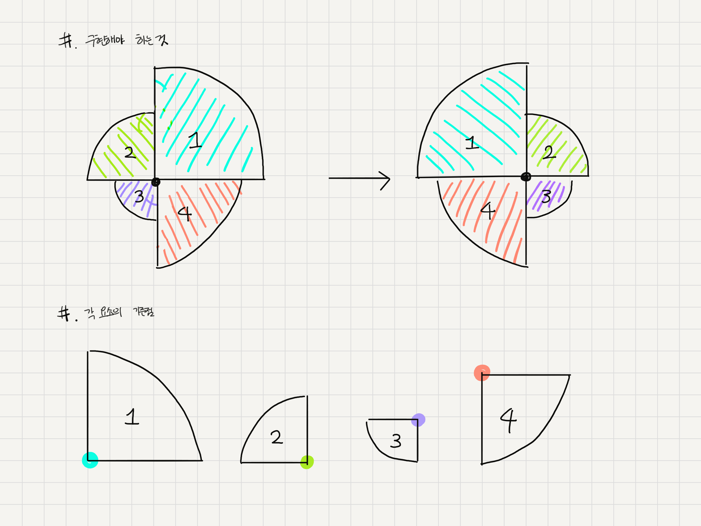

# css loading spinner 구현하기

- 새 모앙의 css loading spinner를 구현하기
- 문제의 핵심 : 각 요소들이 서로 다른 방향으로 회전해야 한다.

### 핵심 개념

- css transform origin
  - 회전의 중심점을 지정.
  - 각 요소의 중심점이 다르므로 css transform origin으로 지정해서 회전시켜야 함.
    

---

참고
[CSS Transform Origin](https://developer.mozilla.org/en-US/docs/Web/CSS/transform-origin)
